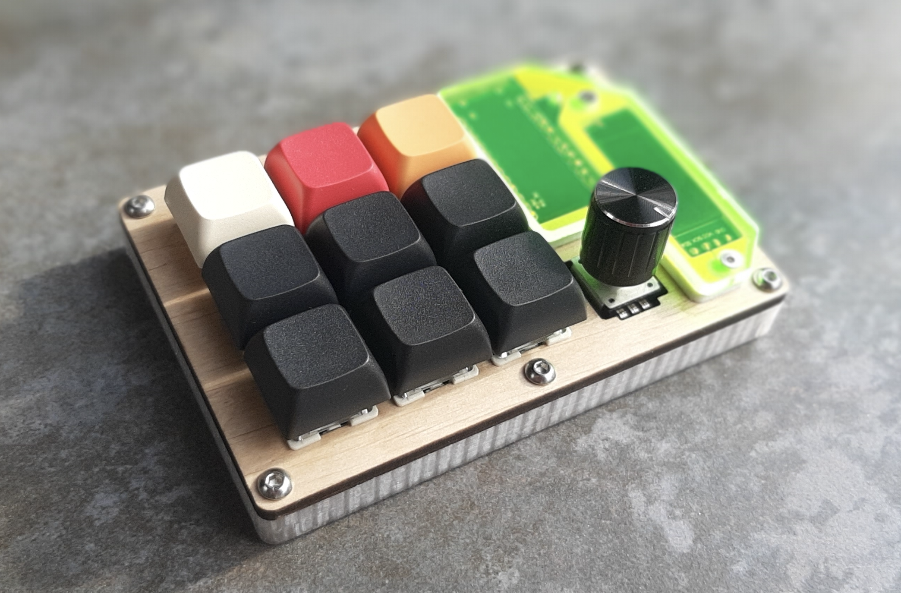

### Макроклавіатура macropad9

---

Макроклавіатура оснащена надійними механічними свічами Gateron Brown, що забезпечують приємний тактильний відгук. Її можна повністю перепрограмувати на свій розсуд: ви можете дублювати будь-які клавіші основної клавіатури або налаштовувати складні комбінації (макроси) для швидшої роботи.

Клавіатура ідеально підходить для створення окремих профілів для різних програм, таких як Blender, Fusion360, Solid Works, DaVinci Resolve, Adobe Photoshop, або будь-якого іншого софту, з яким ви працюєте. За допомогою профілів ви зможете зручно налаштувати клавіатуру під свої потреби в кожній програмі. Перемикання профілів відбувається одним натисканням на енкодер, а назва активного профілю відображається на OLED екрані. Наприклад, перший профіль можна налаштувати як Numpad, другий — для роботи у Fusion360, третій — для керування YouTube, четвертий — для управління курсором миші, а п’ятий — для Blender. Профілів може бути скільки завгодно.

Клавіатура має невеликий OLED екран, на який можна виводити текст, малюнки або важливу інформацію, наприклад активний профіль. Це дозволяє завжди бути в курсі того, які саме функції клавіатура може виконувати в цей момент.

Окрім того, на клавіатурі є енкодер, який можна налаштувати на різні функції, такі як регулювання гучності, швидке скасування або повторення дій (undo/redo), прокручування сторінок (page up/page down) або навіть керування мишиним скролом. Це зручне рішення для тих, хто цінує продуктивність та багатофункціональність.

Приємна RGB підсвітка клавіатури підтримує безліч готових ефектів, які можна легко змінювати залежно від вашого настрою або активного профілю.

---

Технічні характеристики:

* 9 механічних клавіш зі свічами Gateron Brown (XDA кейкапи)
* Енкодер з алюмінієвим ковпачком
* 0.91" OLED екран (128x32, білі пікселі)
* Адресна RGB стрічка з 13 світлодіодами
* Arduino Micro з Type-C підключенням
* Підтримка [QMK firmware](https://qmk.fm)

---

Приклади коду:

* [QMK](https://github.com/one-quaker/qmacropad9)
* [Arduino IDE](https://github.com/one-quaker/macropad9)

---

